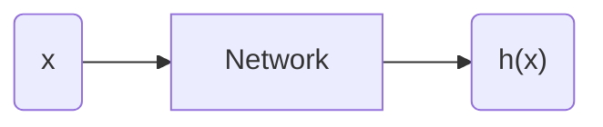

# Q4-2

**理论证明：一个两层的ReLU网络可以模拟任何函数**

假设两层ReLU神经网络如下：

可以将输出 $h(x)$ 表示为：
$$
\begin{equation} \label{eq1}
\begin{split}
h(x) &= W_2^T\ [ReLU(W_1^Tx+b_1)]\ +b_2 \\
&=\sum_{i,j}w_{2_j}\max(0,w_{1_i}x+b_{1_i})+b_{2_j}
\end{split}
\end{equation}
$$
令 $f(x)$ 为斜率和纵截距可变的 ReLU 函数，即 $f(x)=\max(0,w_{1_i}x+b_{1_i})$，则 $h(x)$ 可以表示为：
$$
h(x)=\sum wf(x)+b
$$
即结果可以由多个 relu 函数叠加而成。

故证明转化为任意函数任意段可以由多个（斜率、纵截距可变的） ReLU 函数叠加而成。

对于任意函数如下：

可以使用密集的点将其划分，密集至到两点之间可以近似为直线：

对于任意两点之间，近似的直线可以由至少两个（斜率、纵截距可变的） ReLU 函数完全拟合：

对于三个点之间的两条线段亦是如此：

以此类推，四个点组成三段直线可以用6个变形的 ReLU 函数拟合。

因此，对于任意函数，都可以用近似无数个（斜率、纵截距可变的） ReLU 函数拟合任意位置。

**实验效果见 `q2_ans_proof.ipynb` 和 `q2_ans_proof.py`**

